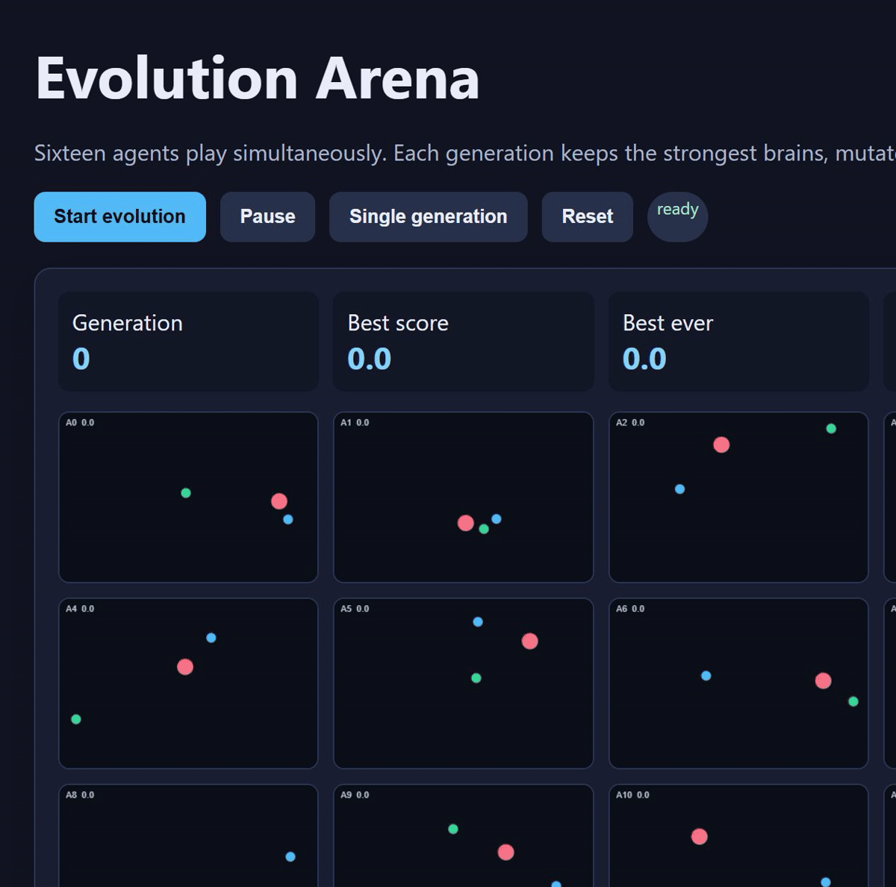
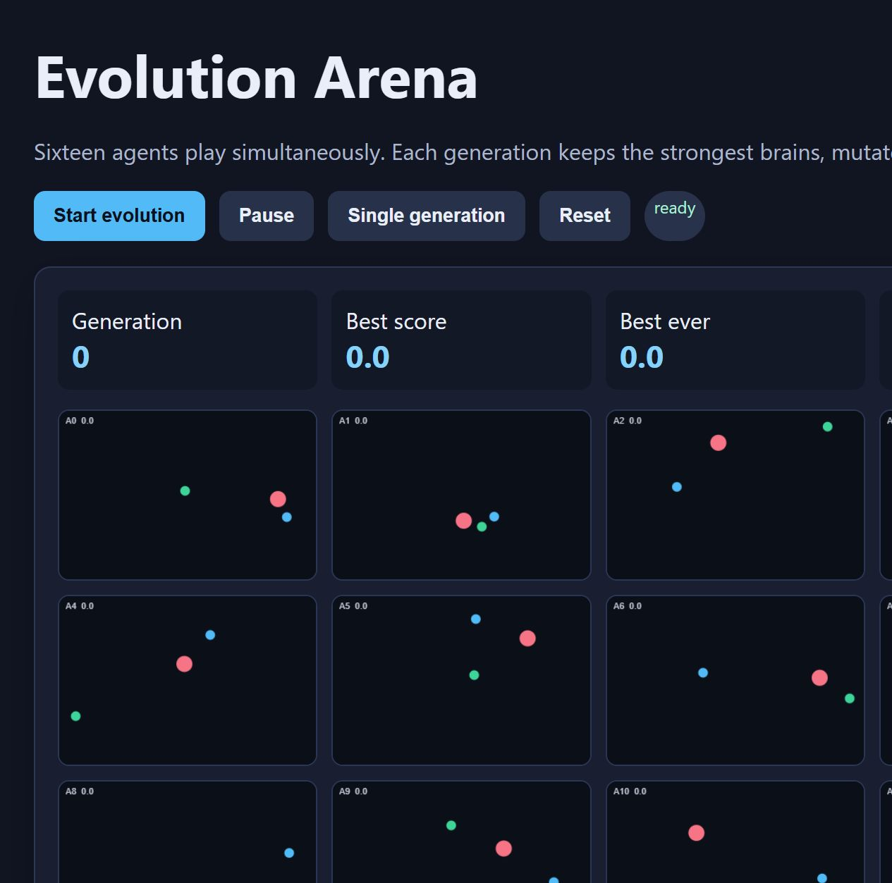
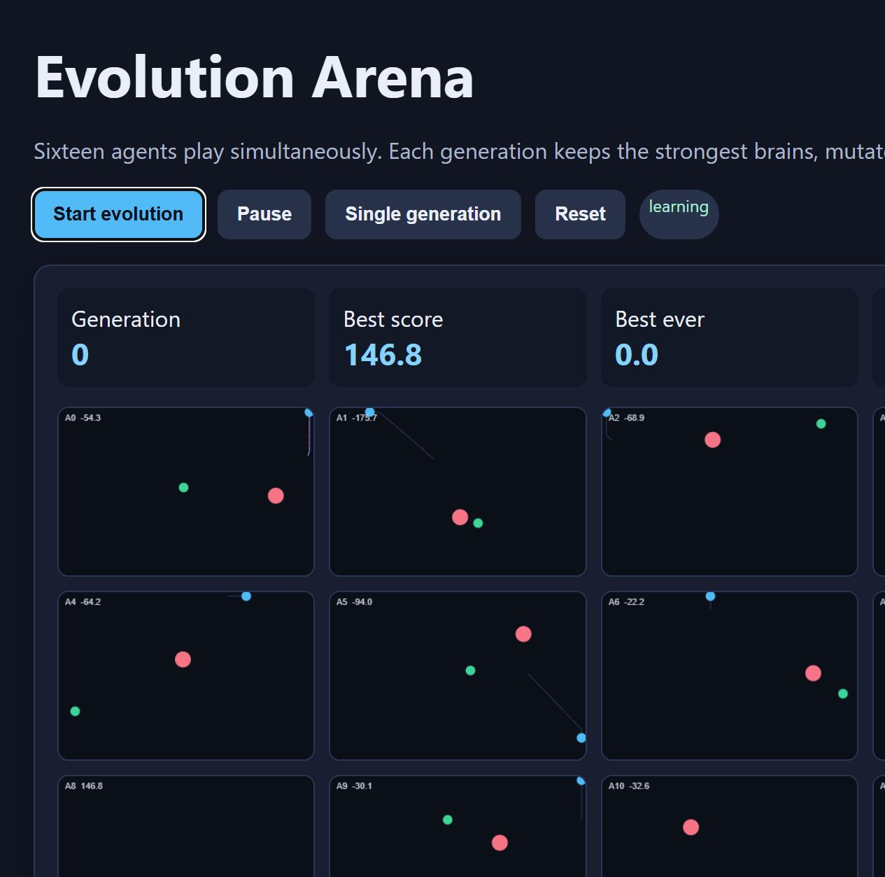
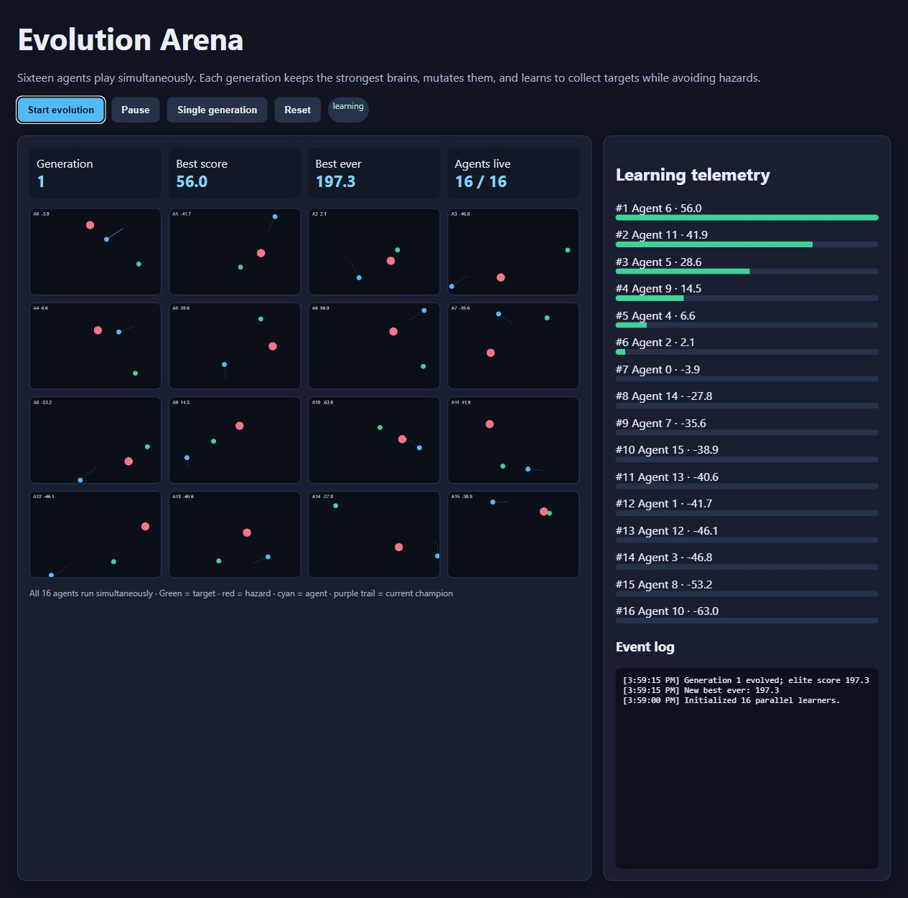

# Suit Lines — Evolutionary Card Game

Suit Lines is a dependency-free browser demo of population-based learning inspired by Spider Solitaire. The four-suit single-deck variant asks players to build descending same-suit lines from King to Ace. Sixteen agents practice the same deal at the same time, receive fitness from completed lines and useful tableau structure, and produce a new generation through elite retention and mutation.

## Live demo

Open `index.html` locally, or serve the folder with:

```powershell
python -m http.server 8765 --directory .
```

Then visit <http://127.0.0.1:8765/>.

The GUI shows the playable tableau, live ranking for all 16 agents, generation number, completed runs, move count, best-ever fitness, and an evolution log.

## Real run

The media below was captured from the hosted application while it was running. It shows the ready state, live agents, and a generation rollover with a recorded best-ever score.



| Ready state | Running state | Generation 1 |
|---|---|---|
|  |  |  |

## What it does

- Runs a population of 16 agents and renders multiple games simultaneously.
- Each agent uses a small neural-style policy to steer toward targets and away from hazards.
- Scores are evaluated over episodes; the top four brains become the next generation's elites.
- Remaining agents are mutated copies, creating evolutionary learning across generations.
- The dashboard shows generation, live scores, best-ever score, trails, and a compact event log.

## Rules

- Build down by rank: a card can be placed on the next higher rank.
- Only a same-suit descending run can be selected and moved as a group.
- A complete same-suit King-to-Ace line is removed and counts toward the four-run goal.
- The included variant uses one deck and eight tableau columns so the goal is exactly four suit lines.

## Learning behavior and limits

The demo uses a small weighted move-scoring policy rather than full NEAT. Each agent scores legal moves using learned weights for same-suit chains, completed runs, and open columns. This keeps the project understandable and runnable from a single HTML file. It is an evolutionary learner, not a proof of general intelligence: performance depends on the deal, fitness function, random seed, and episode length.

“Improvement” is measured by the best fitness observed in each generation and the persistent best-ever score. Because evolution is stochastic, a particular run can temporarily regress; elite preservation prevents the best brain from being discarded when the next population is created.

## Controls

- **Start evolution**: continuously run episodes and generations.
- **Pause**: freeze or resume learning.
- **Single generation**: run one full episode manually.
- **Reset**: start a fresh population.

## Research notes

`research-notes.md` is reserved for source-grounded notes from the requested YouTube and multi-chat research pass. The local game is intentionally dependency-free so it can be tested immediately while research is collected.

## Verification checklist

- JavaScript syntax checked with `node --check`.
- Browser smoke test confirmed 16 visible agent canvases and `16 / 16` live population.
- Runtime demo confirmed card tableau rendering, 16 ranked agents, score updates, and generation rollover with a best-ever fitness recorded.
- No package installation or network service is required to run the demo.
